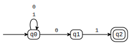
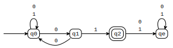
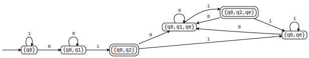
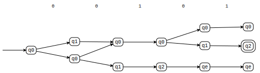
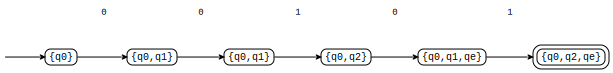

# Equivalence between NFA and DFA
- For many languages, it is easier to construct an NFA than a DFA.
- Surprisingly, however, for any NFA $N$ there is a DFA $D$, such that $L(D) = L(N)$, and vice versa.
- Finding such equivalent DFA involves an algorithm for $subset construction$, an important example on how an automaton $B$ can be generically constructed from another automaton $A$.
- Given an NFA $N = (Q_N,\Sigma,\delta_N,q_0,F_N)$, we will construct a DFA $D = (Q_D, \Sigma, \delta_D, \{q_0\}, F_D)$ such that $L(D) = L(N)$

# The subset construction method


```python
# Given the NFA 
from tock import *
m1 = read_csv('nfa1.csv')
m1
```





### Obtaining the DFA
- $Q_D=\{S:S\subseteq Q_N\}$, i.e., all possible subsets of $Q_N$
- $\Sigma_D=\Sigma_N$
- $q_{0D} = q_{0N}$
- $F_D=\{S\subseteq Q_N:S\cap F_N\neq \emptyset\}$

# In state transition table notation
$$\begin{matrix}
&0&1\\\hline\hline
\emptyset&&\\
\rightarrow\{q_0\}&&\\
\{q_1\}&&\\
\star\{q_2\}&&\\
\{q_0, q_1\}&&\\
\star\{q_0,q_2\}&&\\
\star\{q_1, q_2\}&&\\
\star\{q_0,q_1,q_2\}&&
\end{matrix}
$$
Next, let's obtain the transitions for the DFA

# Subset construction: transition function


```python
m1
```


$\delta_D$: For every $S\subseteq Q_N$ and $a\in \Sigma$, 
$\delta_D(S,a)=\displaystyle\bigcup_{p\in S}\delta_N(p,a)$


# A more direct subset construction
- We can avoid generating all possible subsets of states by performing "lazy evaluation" on the subsets.
- To convert a NFA $N$ into a DFA $D$ the idea is to construct the transition table for $D$  only for **accessible** states $S$ in $N$, as follows:
- **Basis:** $S=\{q_0\}$ is accessible
- **Induction:**  If state $S$ is accessible, then for each input symbol $a$ we compute the  states that are accessible from $S$ with transitions on $a$, i.e.:
$$
\delta_D(S,a)= \displaystyle\bigcup_{p\in S}\delta_N(p,a)
$$

Let's *determinize* an NFA using this method. 


# *Determinizing* an NFA using Tock
- First lets *determinize* the NFA below by hand (on the board).
- Then let's use function `determinize()`


```python
from tock import *
n1 = read_csv('nfa2dfa1.csv')
n1
```





```python
d1=determinize(n1)
d1
```





# Let's run the DFA and the NFA on the string 00101


```python
# Let's run the DFA and the NFA on the string 00101
n1
```


```python
run(n1, '0 0 1 0 1')
```





```python
d1
```


```python
run(d1, '0 0 1 0 1')
```





# A DFA obtained from a NFA recognizes the same language
- If $D=(Q_D, \Sigma, \delta_D, \{q_0\}, F_D)$  is the DFA constructed from NFA $N=(Q_n,\Sigma, \delta_N, q_0, F_N)$ by subset construction, then $L(D)=L(N)$.

- **Proof**: First we show on an induction on $|w|$ that $$ \hat\delta_D(\{q_o\}, w)=\hat\delta_N(q_0, w)$$
- **Basis**: $w=\epsilon$. The claim follows from the definition of $\hat\delta$


# Proof (cont.)


- Since both $D$ and $N$ accept $w$ if and only if $\hat{\delta}_D(\{q_0\}, w)$ or $\hat{\delta}_N(q_0, w)$ contain a state in  $F_N$, it follows that $L(D)=L(N)$

# e-NFA: Automata with spontaneous moves
- Such moves are depicted in the state-transition diagram as an arc labelled $\epsilon$
- Such arcs are quite handy for assembling automata recognizing a regular composition of finite-state languages.
- Moreover, e-NFA are useful in proving the equivalence between the language accepted by a FA (a machine-like description of a language) and by a **regular expression** (an algebraic description of a language)

# Example of e-NFA

An e-NFA that recognizes an optional + or - sign, a string of digits, a decimal point, and another string of digits.


